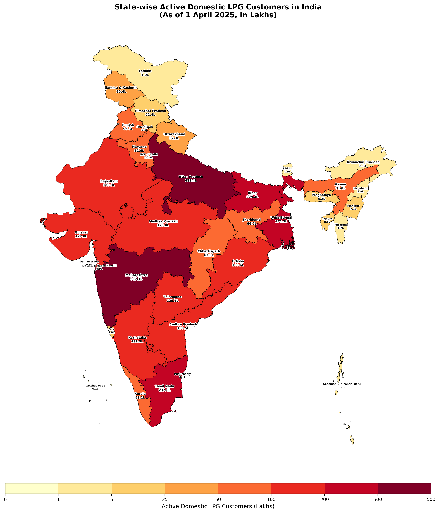

# India Public Data Visualised

Interactive visualisations built from publicly available Indian government datasets — with context on why the numbers matter right now.

## Visualisations

### 1. State-wise Active Domestic LPG Customers (Apr 2025)

**[View Live Map](https://ashutosh-fyi.github.io/india-public-data-viz/)**

Interactive choropleth map showing the distribution of active domestic LPG customers across Indian states and union territories.

### Why this, why now?

This visualisation was triggered by a [tweet from @PetroleumMin](https://x.com/PetroleumMin/status/2031058085952000251) sharing the state-wise breakdown of active domestic LPG connections. A seemingly routine data release — until you overlay it with what's happening in the Strait of Hormuz right now.

**329.7 million households** depend on LPG for daily cooking. That's the number on this map. Here's what makes it urgent:

- **67% of India's LPG is imported.** Domestic production covers only ~12.8 MT against a total requirement of ~36 MT.
- **85–90% of those imports flow through the Strait of Hormuz** — the same chokepoint that Iran's IRGC has effectively blockaded since late February 2026, following the US-Israel strikes.
- **India has ~10 days of LPG buffer stock** (~1 MT storage against ~3 MT monthly demand). Compare that to 40+ days of strategic petroleum reserves for crude oil. LPG has no such cushion.
- **38 Indian ships are reported stuck** in the Persian Gulf region. Several tankers carrying crude and LPG to India are unable to move freely.
- The government has already [ordered refiners to maximise domestic LPG output](https://www.business-standard.com/economy/news/govt-orders-refiners-to-boost-lpg-output-as-hormuz-disruption-worsens-126030601208_1.html), [raised the booking gap to 25 days to curb hoarding](https://www.businesstoday.in/india/story/government-moves-to-curb-hoarding-as-lpg-demand-spikes-booking-gap-raised-to-25-days-519766-2026-03-09), and some cities like Pune have [shut gas crematoriums](https://www.businesstoday.in/india/story/iran-war-disrupts-lpg-supply-pune-shuts-gas-crematoriums-punjab-halts-commercial-supply-519763-2026-03-09) while Punjab has halted commercial LPG supply.

The map puts a shape to the scale of exposure. Uttar Pradesh alone has 483 lakh connections — nearly 50 million households whose cooking fuel runs through a strait that's currently under naval blockade.

### The data

- **Source:** [Petroleum Planning & Analysis Cell (PPAC)](https://www.ppac.gov.in/), Ministry of Petroleum & Natural Gas
- **Data date:** 1 April 2025
- **Unit:** Lakhs (1 Lakh = 100,000)

| Metric | Value |
|---|---|
| All-India active connections | ~3,297 lakh (329.7M) |
| Highest (Uttar Pradesh) | 483 lakh |
| Lowest (Lakshadweep) | 0.14 lakh |
| Import dependency | ~67% |
| Share of imports via Hormuz | ~85–90% |
| Strategic LPG buffer | ~10 days |

### Further reading

- [How One LPG Cylinder in Your Kitchen Is Linked to the Strait of Hormuz](https://thebetterindia.com/informed-india/how-much-of-indias-crude-oil-petrol-and-lpg-depends-on-the-strait-of-hormuz-11168960) — The Better India
- [Strait of Hormuz crisis reshapes global oil markets](https://www.kpler.com/blog/us-iran-conflict-strait-of-hormuz-crisis-reshapes-global-oil-markets) — Kpler
- [LPG import dependence meets Hormuz disruption](https://www.policycircle.org/economy/india-lpg-import-hormuz-disruption/) — Policy Circle
- [20% of global oil at risk as Hormuz blockade halts ships](https://www.businesstoday.in/latest/economy/story/20-of-global-oil-at-risk-as-hormuz-blockade-halts-ships-crude-surges-36-in-a-week-of-iran-israel-conflict-519557-2026-03-07) — Business Today
- [2026 Strait of Hormuz crisis](https://en.wikipedia.org/wiki/2026_Strait_of_Hormuz_crisis) — Wikipedia

**Tech:** Leaflet.js, GeoJSON, vanilla JS — no build step required.

---

*More visualisations will be added as interesting public datasets surface.*
